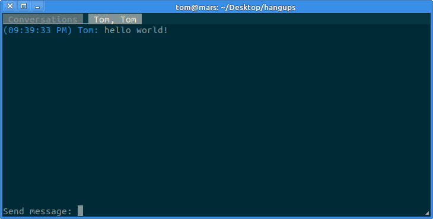

# hangups

hangups is a reverse-engineered library and basic client for using Google's
Hangouts chat protocol.

In May 2013 Google replaced their "Talk" instant messaging product, based on
XMPP, with "Hangouts", [which adopted a proprietary, non-interoperable
protocol](https://www.eff.org/deeplinks/2013/05/google-abandons-open-standards-instant-messaging).
For now it's still possible to connect to Hangouts over XMPP using a
third-party client like Pidgin, but features including group messaging are not
available.



## What works

* login with second factor support
* receiving chat messages and other events via push
* sending chat messages
* simple API for writing clients
* example client with text UI for interacting with conversations

## Running

Python 3.4 is required (Python 3.3 might work but is not tested).

```
pip install -r requirements.txt
```

```
python -m hangups
```
